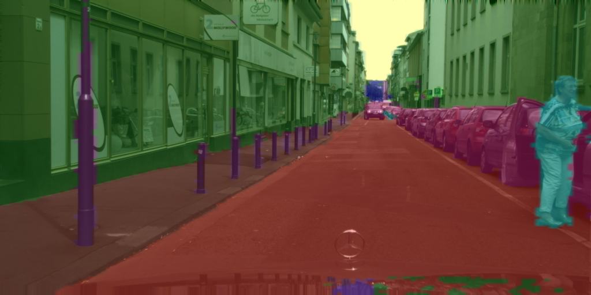
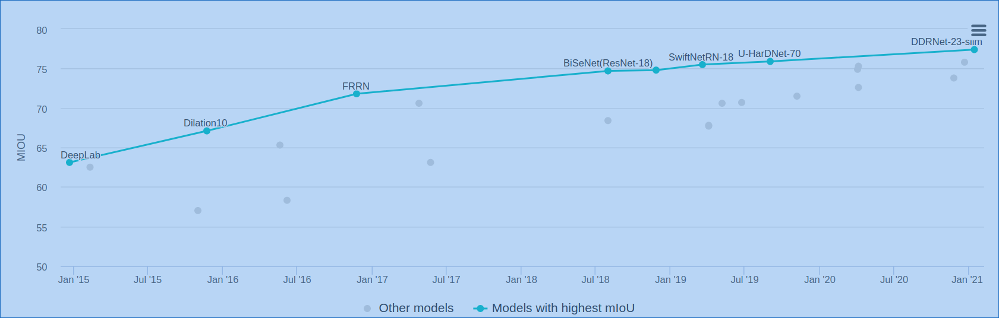

# DDRNet

TensorRT implementation of the official [DDRNet](https://github.com/ydhongHIT/DDRNet)

<p align="center">

</p>

[DDRNet-23-slim](https://paperswithcode.com/paper/deep-dual-resolution-networks-for-real-time) outperform other light weight segmentation method,[see](https://paperswithcode.com/sota/real-time-semantic-segmentation-on-cityscapes)




## Compile&Run

* 1. get model.wts

  Download the wts [model](url: https://pan.baidu.com/s/1Cm1A2mq6RxCFhUJrOJBSrw  ;passworld: p6hy ) convert from official implementation.

  note  that we do not use extral segmentation head while inference(set augment=False in https://github.com/ydhongHIT/DDRNet/blob/76a875084afdc7dedd20e2c2bdc0a93f8f481e81/segmentation/DDRNet_23_slim.py#L345).

* 2. cmake and make

     config ur cmakelist and
  
  ```
  mkdir build
  cd build
  cmake ..
  make -j8
  ./ddrnet -s             // serialize model to plan file i.e. 'DDRNet.engine'
  ./ddrnet -d  ../images // deserialize plan file and run inference, the images in samples will be processed.
  ```


## FPS

Test on RTX2070

| model          | input           | FPS  |
| -------------- | --------------- | ---- |
| Pytorch-aug    | （3,1024,1024） | 107  |
| Pytorch-no-aug | （3,1024,1024） | 108  |
| TensorRT-FP32  | （3,1024,1024） | 117  |
| TensorRT-FP32  | （3,1024,1024） | 215  |

Pytorch-aug means augment=True.

## Difference with official

we use Upsample with "nearest" other than "bilinear",which may lead to lower accuracy .

Finetune with "nearest" upsample may recover the accuracy.

Here we convert from the official model directly.

## Train 

1. refer to:https://github.com/chenjun2hao/DDRNet.pytorch
2. generate wts model with getwts.py

## Train customer data

wirte your own dataset and finetune the model with cityscape.